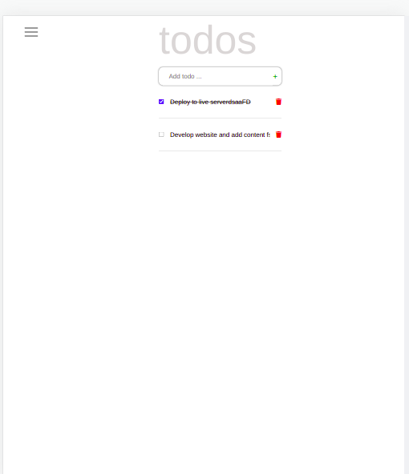
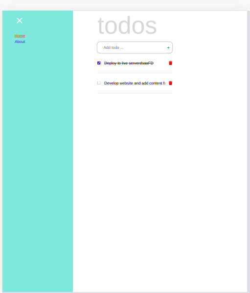
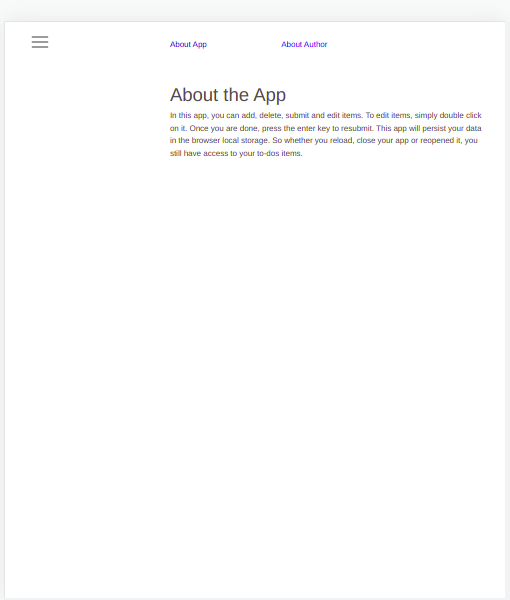

# Todo App

"Todo App" is a web app for daily todos. It features include:
- creating todo
- marking todo as complete or incomplete
- editing todo
- deleting todo

## Screenshots

## Live Demo

[Live Demo Link](https://wuyepabdul.github.io/react-todo/)

## Built With

- CSS
- JS
- React

## Getting Started

**To clone this project**
**Run command: $git clone https://github.com/wuyepabdul/react-todo.git**
**or press the green Code button in the upper right corner and choose to download from the Download ZIP link.**

### Prerequisites

- Code editor (VS Code, Sublime, Atom)

## Run Tests

cd into javascript-capstone
npm run test

## Authors:

👤 **Abdul Wuyep**
- GitHub: [@wuyepabdul](https://github.com/wuyepabdul)
- LinkedIn: [@abdul-wuyep](https://www.linkedin.com/in/abdul-wuyep-6a27721b8/) 

## 🤝 Contributing

Contributions, issues and feature requests are welcome!

Feel free to check the [issues page](https://github.com/wuyepabdul/react-todo.git/issues).

## Show your support

Give a ⭐️ if you like this project!

## Acknowledgments

- Microverse

## 📝 License

This project is [MIT](./MIT.md) licensed.
